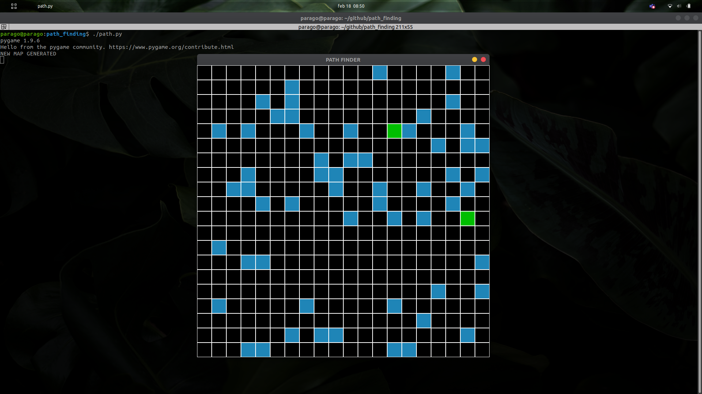
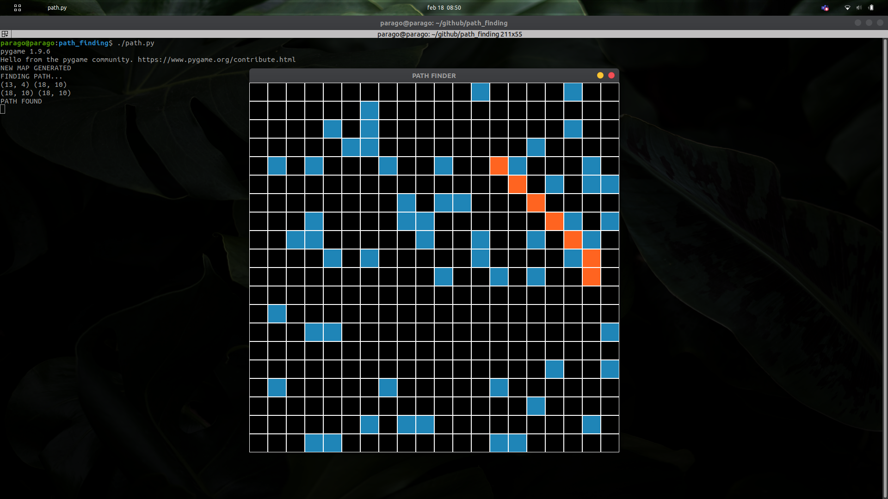

Path finding project using pygame for the GUI and A* for the algorithm.

INSTRUCTIONS:
  - SPACEBAR to generate a random map
  - RETURN to run program with current random map

REQUISITES:
 - pygame
 - python3
 

